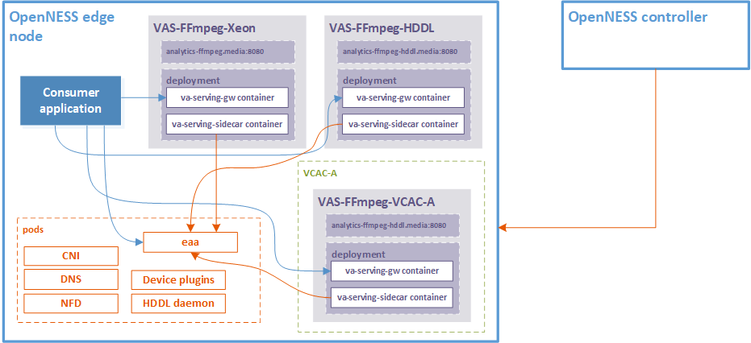
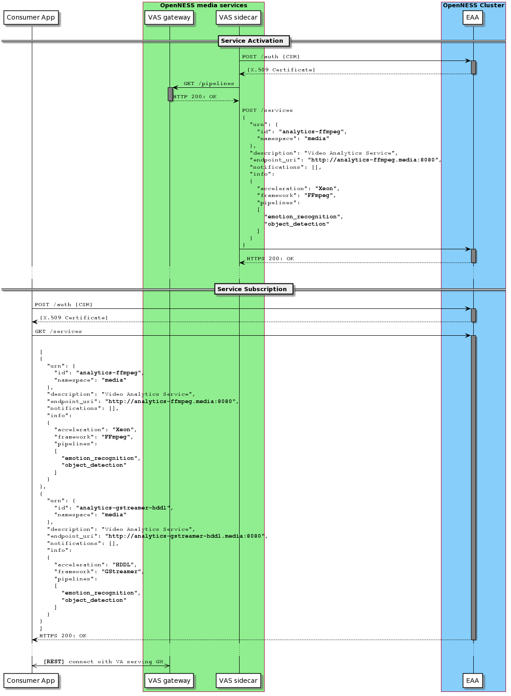

```text
SPDX-License-Identifier: Apache-2.0
Copyright (c) 2020 Intel Corporation
```
<!-- omit in toc -->
# Video Analytics Services
- [Overview](#overview)
- [Video Analytics Service Deployment](#video-analytics-service-deployment)
- [Consuming Video Analytics Services](#consuming-video-analytics-services)
- [Getting Started with Video Analytics Services](#getting-started-with-video-analytics-services)
- [References](#references)

## Overview
OpenNESS furnishes the Video Analytics Services (VAS) to enable third party edge application of deploying and using hardware optimized video analytics pipelines. Video analytics services are based on [Video Analytics Serving](https://github.com/intel/video-analytics-serving) that expose REStful APIs to start, stop, enumerate and customize pre-defined pipelines using either [GStreamer](https://github.com/opencv/gst-video-analytics/wiki) or [FFmpeg](https://github.com/OpenVisualCloud/Dockerfiles/blob/master/doc/ffmpeg.md). Application vendors create pipeline templates using their framework of choice and VAS manages launching pipeline instances based on incoming requests.

## Video Analytics Service Deployment
Video analytics services are installed by OpenNESS Experience Kits (OEK) when `media-services` or `media-services-vca` flavors are deployed. These flavors include the video analytic services role in the Ansible playbook by setting the flag `video_analytics_serving_enable: true` internally. When the role is included, multiple VAS instances are deployed. An instance of the VAS consists of two containers:
1. Video analytics serving gateway (VAS gateway)
2. Video analytics serving sidecar (VAS sidecar)

The *VAS gateway* is the artifact created [when building the Video Analytics Serving](https://github.com/intel/video-analytics-serving#building-and-running) and is exposed as a Kubernetes service endpoint, e.g: `http://analytics-ffmpeg.media:8080`.

The *VAS sidecar* interfaces with the Edge Application Agent (EAA) to register the VAS instance whereby it becomes discoverable by other third party (consumer) applications. The service registration phase provides information about the service such as:
1. Service endpoint URI, e.g: `http://analytics-ffmpeg.media:8080`
2. Acceleration used: `Xeon`, `HDDL` or `VCAC-A`
3. Underpinning multimedia framework: `GStreamer` or `FFmpeg`
4. Available pipelines: `emotion_recoginition`, `object_detection` and other custom pipelines



_Figure - VAS Deployment_

Multiple instances of the VAS can co-exist in an OpenNESS cluster depending on the available hardware resources, as depicted in the figure above. Standalone service endpoints are created for every multimedia framework and acceleration type.

Examples of VAS instances are:
- VAS based on FFmpeg framework on CPU: `http://analytics-ffmpeg.media:8080`
- VAS based on GStreamer framework on CPU: `http://analytics-gstreamer.media:8080`
- VAS based on FFmpeg framework accelerated using HDDL: `http://analytics-ffmpeg-hddl.media:8080`
- VAS based on GStreamer framework accelerated using HDDL: `http://analytics-gstreamer-hddl.media:8080`
- VAS based on FFmpeg framework executing on VCAC-A: `http://analytics-ffmpeg-vca-a.media:8080`
- VAS based on GStreamer framework executing on VCAC-A: `http://analytics-gstreamer-vca-a.media:8080`

## Consuming Video Analytics Services
When consumer applications land on the OpenNESS cluster, they must authenticate through the [Edge Application Authentication API](https://www.openness.org/api-documentation/?api=auth) in order to continue subsequent interactions with EAA that are taking place over TLS. Applications receives a JSON-formatted list when querying [the service discovery API](https://www.openness.org/api-documentation/?api=eaa#/Eaa/GetServices) that give information of the available services including the VAS. This information includes elements such as: the service endpoint URI, acceleration type, underpinning multimedia framework and the available pipelines. The VAS-specific information is contained in the `"info"` element.

A sample service discovery JSON return is given below:
```json
[
  {
    "urn": {
      "id": "analytics-ffmpeg",
      "namespace": "media"
    },
    "description": "Video Analytics Service",
    "endpoint_uri": "http://analytics-ffmpeg.media:8080",
    "notifications": [],
    "info":
    {
      "acceleration": "Xeon",
      "framework": "FFmpeg",
      "pipelines":
      [
        "emotion_recognition",
        "object_detection"
      ]
    }
  }
]
```

The consumer application learns the VAS endpoint URIs from the returned list and decides on which service instance is best-fit for its needs, then it reaches out to the VAS endpoint and communicates directly in order to avail the video analytics service through [their serving gateway APIs](https://github.com/intel/video-analytics-serving#interfaces).

The figure below demonstrates the sequence of interactions of the VAS, the EAA and the consumer application:



_Figure - VAS Activation and Discovery through EAA_

1. The VAS sidecar authenticates with the EAA
2. The VAS sidecar retrieves the pipelines that are available in VAS gateway
3. The VAS sidecar registers the service with EAA
4. The consumer application authenticates with EAA
5. The consumer application queries the available services
6. The returned list contains the information about the VAS
7. The consumer application learns the VAS endpoint URI and reaches out directly

## Getting Started with Video Analytics Services

To get started with deploying VAS through OEK, refer to [Media Analytics Flavor](../flavors.md#media-analytics-flavor) and to [Media Analytics Flavor with VCAC-A](../flavors.md#media-analytics-flavor-with-vcac-a).

If creating a customized flavor, the VAS can be deployed when setting the flag `video_analytics_serving_enable: true` in Ansible playbook.

## References
* [Video Analytics Serving](https://github.com/intel/video-analytics-serving)
* [Edge Application API](https://www.openness.org/api-documentation/?api=eaa)
* [OpenNESS Application development and porting guide](./openness_appguide.md)
